## Rapport TP1 : Traitement d'image

### Équipe
- COTTIER ALEXANDRE
- VU ANH DUY

---

### Annexes
1. Code source : disponible sur https://forge.univ-lyon1.fr/p2018147/analyse.
2. Images de test : fournies dans le dossier "donnee" et "donnee2".
3. Résultats finaux : disponibles dans le dossier "resultat".
4. Pour compiler, il suffit de se rendre dans le dossier build et entrer `make`, cela devrait compiler tous les fichiers un par un en plus des interfaces UI (texte) et Qt (graphique) qui ont réutilisé les fonctions qu'on a au préalable faites dans d'autres fichiers de base.

5. Instructions pour exécuter le projet :
   - Aller dans le dossier `build/`
   - Exécuter d'abord `cmake ..`
   - Puis compiler avec `make`.
   - Exécuter avec `./filtrage_median`, `./convolution`, etc.
   - Pour avoir les interface texte (Ui) : `./ui_module` et interface graphique (Qt) : `./test_module` 
6. Dans l'interface texte, il faut dès le départ faire `load image` et choisir l'image voulue, elles sont stockées dans : `../donnee/*.png` ou `../donnee2/*.png`.
Idem pour l'interface Qt mais ici on choisi a la main gràce a l'interface graphique.
7. Dans l'interface Qt (test_module), pour les options qui ne nécéssites pas un kernel, on utilise l'extra parameter !

**/!\ Pour executer Qt il faut l'avoir d'installer sur sa machine !**

---

### Implémentation

#### Choix des bibliothèques
1. **OpenCV** : Utilisé pour comparer nos résultats avec ceux d'une bibliothèque établie.
2. **iostream** (pour les entrées/sorties standard)
3. **vector** (pour manipuler les collections dynamiques de pixels)
4. **algorithm** (pour utiliser std::nth_element et trier partiellement le voisinage)
5. **Qt** Pour ce qui est de l'interface graphique.

#### Filtrage médian

- **Principe** :  
  Le filtrage médian est une technique de traitement d'image utilisée pour réduire le bruit impulsionnel sans trop altérer les contours. Contrairement à un filtre moyen qui calcule la moyenne des pixels dans une fenêtre, le filtre médian prend la valeur médiane du voisinage. Cela permet d'éliminer efficacement les pixels aberrants (par exemple, des points très clairs ou très sombres dans un contexte uniforme) en les remplaçant par une valeur plus représentative, tout en préservant mieux les détails structurels de l'image.

- **Fonctions principales** :
   - `applyMedianFilter` :
     Cette fonction prend une image d'entrée, une taille de noyau (généralement impaire: 3, 5, 7, etc.) et produit une image de sortie filtrée par la médiane. Le principe consiste à parcourir chaque pixel (en évitant les bords), à extraire le voisinage local autour du pixel courant, puis à déterminer la valeur médiane des intensités dans cette zone. Le pixel central est alors remplacé par cette valeur médiane. Cela permet d'éliminer les valeurs extrêmes et de lisser le bruit impulsionnel.

#### Implémentation de la fonction générique de convolution et des filtres

1. **Implémentation d’une fonction générique de convolution**  
   Nous avons créé une fonction `applyConvolution` qui prend en entrée une image (sous forme de matrice 2D) et un noyau (masque) de taille L×L. Cette fonction :
   - Parcourt chaque pixel de l’image (en évitant les bords).
   - Pour chaque position, extrait le voisinage correspondant à la taille du noyau.
   - Multiplie chacun des pixels du voisinage par le coefficient correspondant dans le noyau.
   - Calcule la somme de ces produits afin d’obtenir la nouvelle valeur du pixel central.
   - Inscrit cette valeur filtrée dans l’image de sortie.

   Elle sert de base commune à différents types de filtrages (moyen, gaussien, Sobel, etc.).

2. **Filtrage moyen (par convolution)**  
   Le filtre moyen est obtenu en utilisant un noyau dont tous les coefficients sont égaux à 1/(L×L). Par exemple, pour un noyau 3×3, chaque coefficient vaut 1/9. Ce filtre réalise un lissage simple qui remplace chaque pixel par la moyenne de ses voisins, réduisant ainsi le bruit sans altérer trop sévèrement les contours.  
   En utilisant la fonction de convolution générique, il suffit de définir un noyau de moyenneur et d’appliquer `applyConvolution`.

3. **Généralisation avec d’autres noyaux**  
   - **Filtre Gaussien** :  
     Le flou gaussien s’obtient en utilisant un noyau gaussien, dont les coefficients sont calculés selon la fonction de Gauss. Cela permet un lissage plus doux et plus "naturel" que le filtre moyen, car le poids des voisins diminue avec la distance au pixel central.  
     Pour l’exemple, un noyau gaussien 3×3 normalisé (dont la somme des coefficients vaut 1) est utilisé.
   
   - **Filtres différentiels (Laplacien, Sobel, etc.)** :  
     Les filtres Sobel ou Laplacien détectent les gradients d’intensité dans l’image et permettent de faire ressortir les contours. Par exemple, un noyau Sobel en x donnera un gradient horizontal, mettant en évidence les variations brusques dans cette direction. Le Laplacien (par exemple un noyau avec +4 au centre et -1 sur les côtés) met en évidence les zones de transition.  
     Il suffit alors de passer le noyau correspondant à la fonction de convolution pour obtenir le résultat.

4. **Comparaison des résultats**  
   Après avoir appliqué manuellement ces filtres (moyen, gaussien, Sobel), nous avons réalisé les mêmes opérations à l’aide des fonctions intégrées d’OpenCV (`cv::blur`, `cv::GaussianBlur`, `cv::Sobel`).  
   Les images résultantes sont ensuite comparées via leurs histogrammes. En calculant manuellement les histogrammes et en les affichant (ou en calculant une mesure de similarité), nous avons pu évaluer à quel point les versions "maison" se rapprochent des fonctions OpenCV.

#### Transformation d’histogramme
- **Fonctions principales** :
   - `calculateHistogram` : Calcule l'histogramme des niveaux de gris d'une image.
   - `calculateCumulativeHistogram` : Crée l'histogramme cumulé pour égalisation.
   - `equalizeHistogram` : Applique l'égalisation d'histogramme en créant une LUT.
   - `stretchHistogram` : Applique une expansion des niveaux de gris pour améliorer le contraste.
   - `plotHistogram` et `plotLUT` : Affichent l'histogramme et la LUT correspondante sous forme graphique.

#### Option bonus : Transformations géométriques
- **Fonctions principales** :
   - `zoomImage` : Réalise un zoom en redimensionnant l'image.
   - `reduceImage` : Réduit la taille de l'image par interpolation.
   - `rotateImage` : Applique une rotation de l'image autour de son centre.
   - `flipImage` : Effectue des symétries horizontales et verticales.
   - `zoomImageAtPoint` :   permettre de zoomer sur un point spécifique. 

---

### Interface utilisateur

#### Console
- **Fonctions principales** :
   - `displayMenu` : Menu interactif pour sélectionner les traitements.
   - `loadImage` : Charge une image spécifiée par l'utilisateur.
   - `applyMedianFilter`, `applyMeanFilter`, `applyGaussianBlur`, `applySobelFilter`, ... : Appellent les fonctions correspondantes pour appliquer les filtres et transformations comme dit précédemment.

#### Interface graphique (bonus)
- Utilisation de Qt pour :
  - Charger une image.
  - Sélectionner les filtres et transformations.
  - Afficher les résultats.

---

### Résultats

#### Filtrage médian
- **Image originale vs filtrage médian** :

    
    

#### Convolution

1. **Filtrage moyenneur** :
   - **Manuel et Histogrammes** :
   

      
      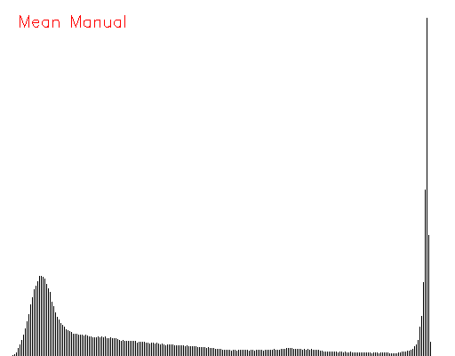
      
   

   - **Comparaison des histogrammes** : Similarité des histogrammes (moyenne) : 0.945531
  
2. **Filtrage gaussien** :
   - **Manuel et Histogrammes** :
   

      
      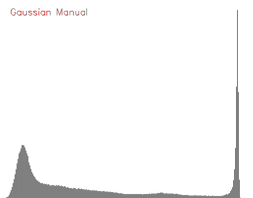
      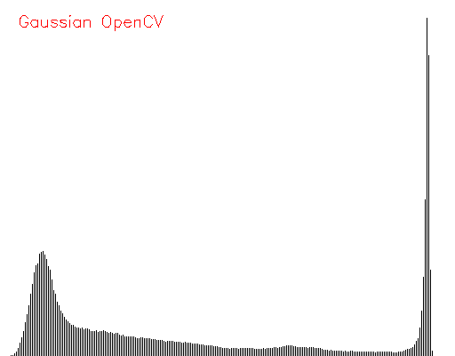
   

   - **Comparaison des histogrammes** : Similarité des histogrammes (gaussien) : 0.972912

3. **Filtrage Sobel** :
   - **Manuel et Histogrammes** :
   

      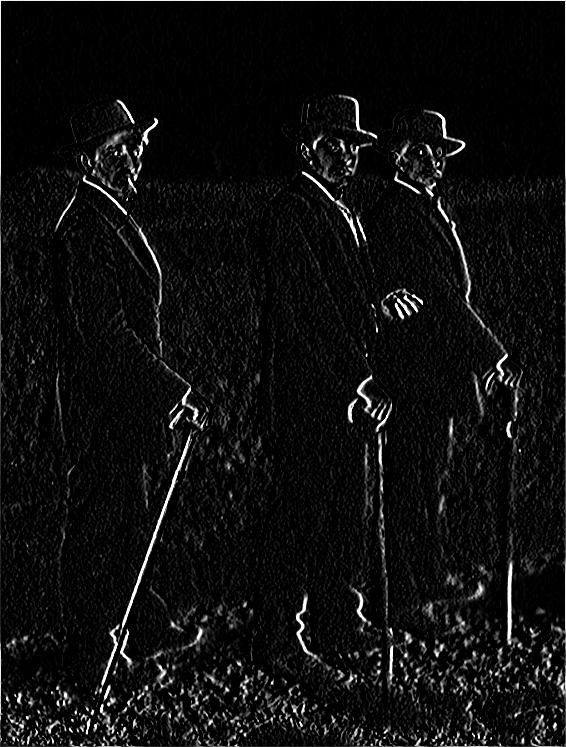
      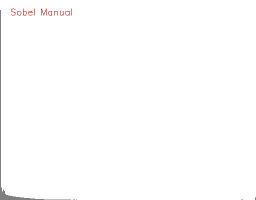
      
   

   - **Comparaison des histogrammes** : Similarité des histogrammes (sobel) : 0.999997

---
  
#### Transformation d’histogramme

1. **Original image et Histogramme** :
   

      
      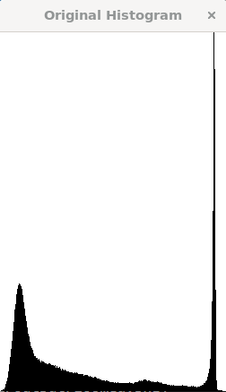
   

2. **Stretched image, Histogramme et LUT** :
   

      
      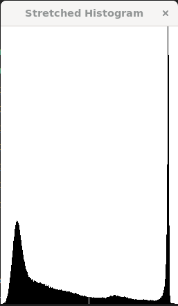
      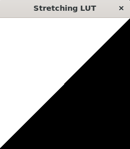
   

          

3. **Equalization image, Histogramme et LUT** :
   

      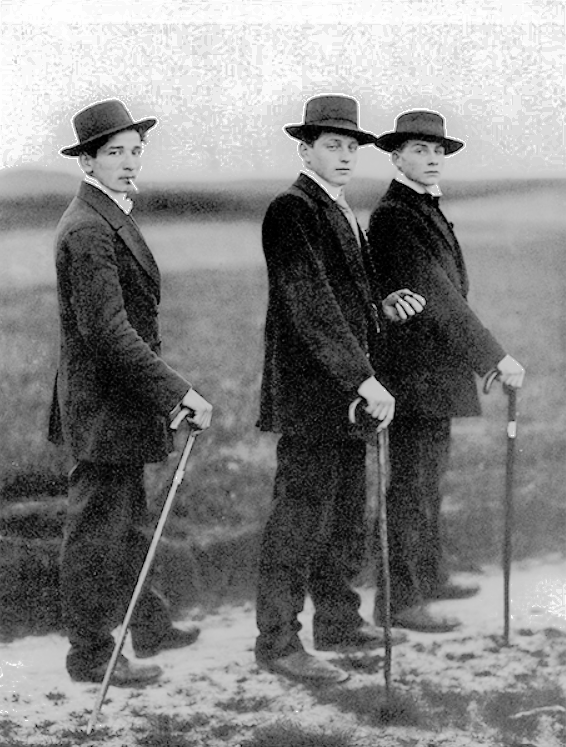
      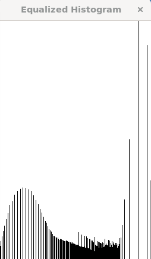
      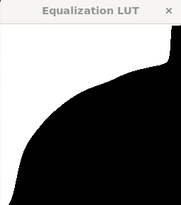
   

                            

#### Transformations géométriques (bonus)
- **Zoom, réduction et rotation appliqués avec succès (manuel).**
   1. **Zoom at one point (au centre avec scale 2)**
   - 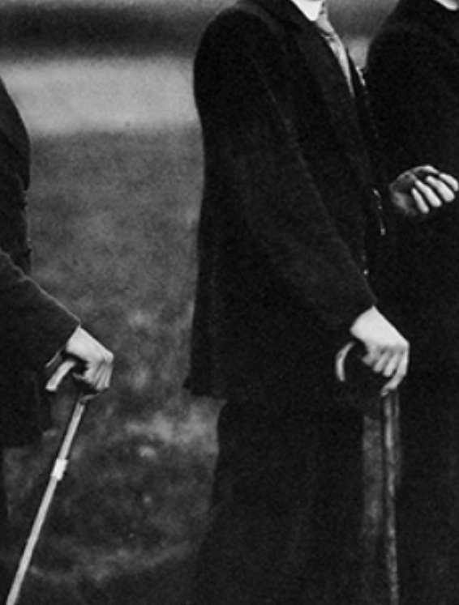

   2. **Reduced avec scale 0.5**
   - 
                 

   3. **Rotated avec degré de 45**
   - 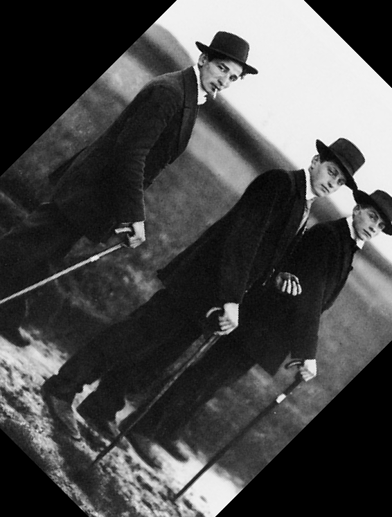

   4. **Flipped - horizontally**
   - 
         

   5. **Zoom avec scale 2**
   - 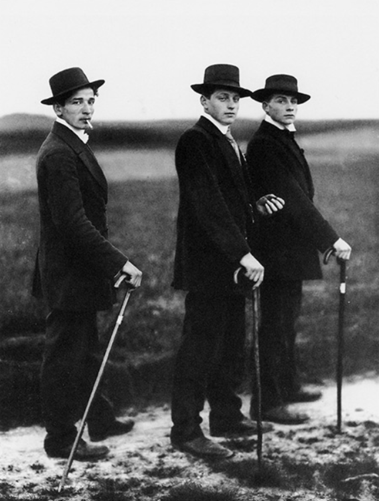

---
### Difficultés rencontrées
1. Gestion des bords pour les filtres.
2. Optimisation des temps de calcul pour les grandes images.
3. Intégration des transformations géométriques avec l’interface graphique.
4. Comparaison entre implémentations manuelles et OpenCV pour s'assurer de la validité des résultats.
5. Pour la partie transformation, par rapport au Zoom et au Reduce on ne savais pas trop si c'étais un vrai zoom (sur un point) ou un aggrandissement d'image qu'il fallait faire vu qu'OpenCV implémente resized mais pas de zoom (et vu qu'on a tendance dans ce tp a réimplanter des fonction déjà éxistante de OpenCV mais a la main..), donc au final on a décider de faire les deux, autant faire plus que pas assez !
6. Problèmes d'affichage avec Qt pour Zoom et Reduce
Lors des tests avec Qt :
   * Pour le zoom, l'image ne s'affichait pas correctement après transformation. Le problème venait du fait que les dimensions de l’image affichée (QPixmap) n'étaient pas ajustées dynamiquement.
   * Pour la réduction, l’image réduisait bien le nombre de pixels, mais l’affichage dans l’interface graphique restait à la taille originale. 
